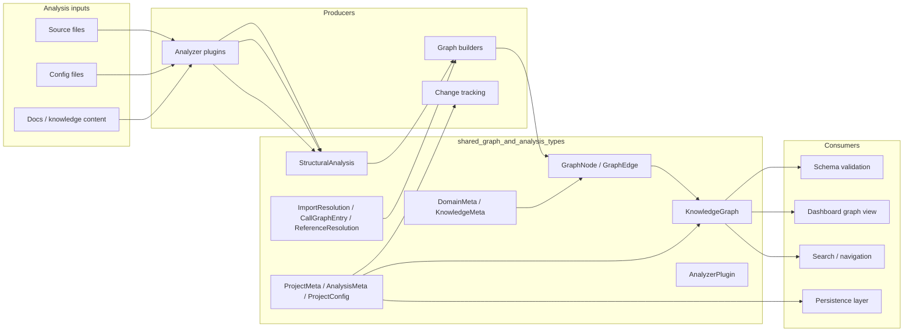
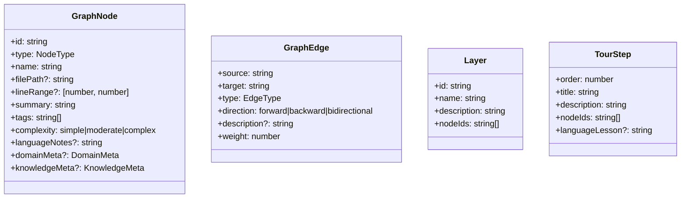
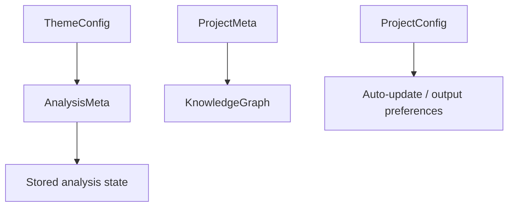
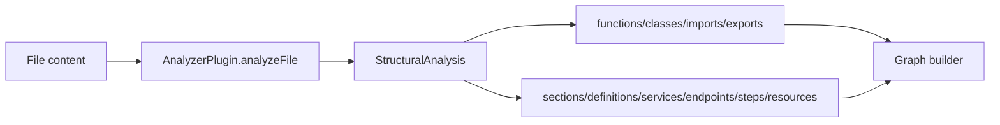
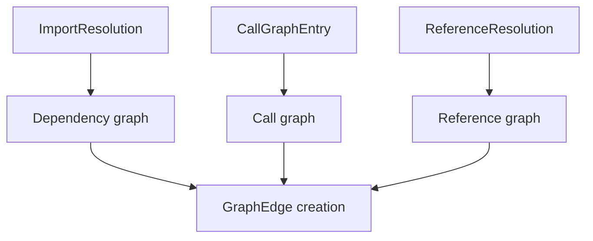
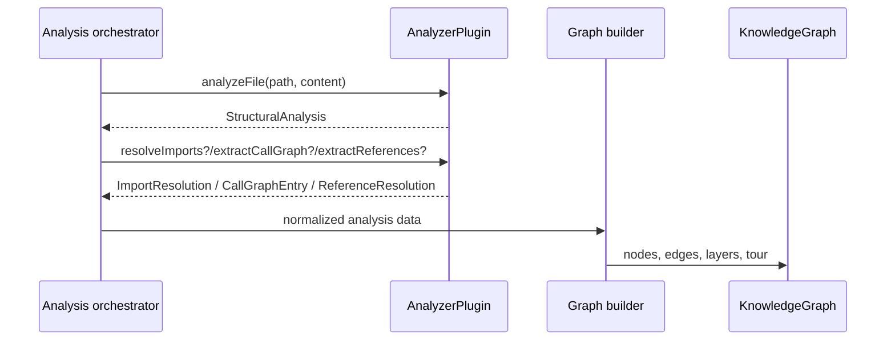
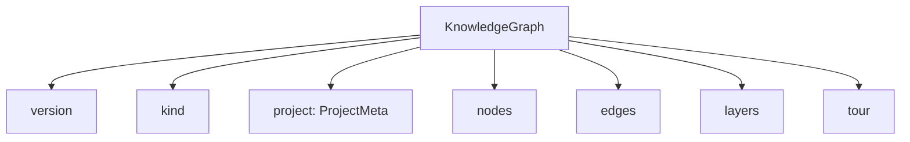
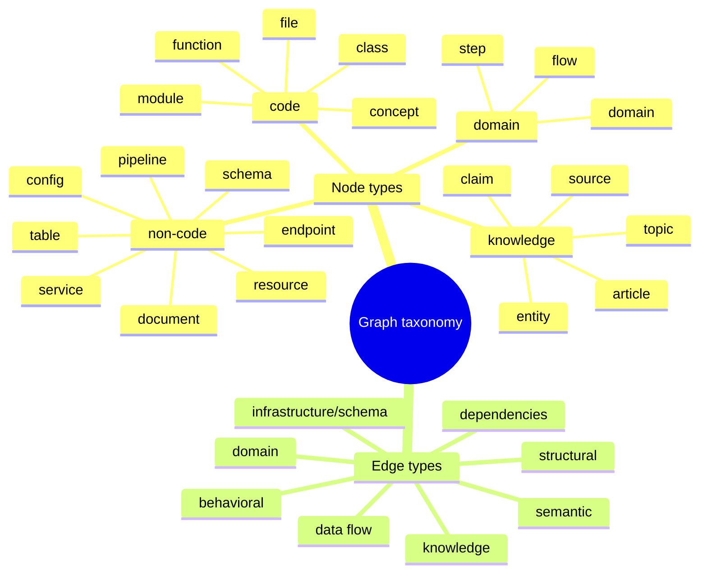
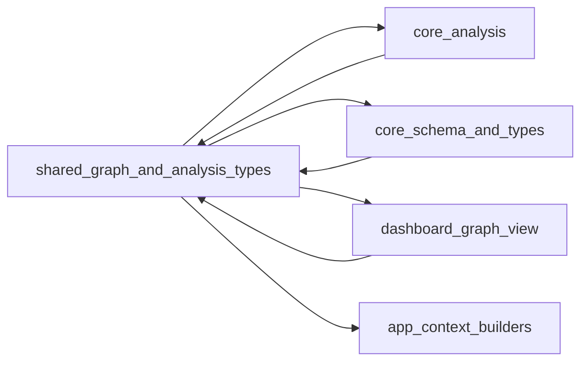

# shared_graph_and_analysis_types

This module defines the shared type system used across the core analysis pipeline, graph construction, persistence, and dashboard rendering. It is the contract that connects file-level structural analysis, graph nodes and edges, project metadata, and plugin outputs into a single `KnowledgeGraph` model.

It is intentionally broad: the same types support codebase graphs, non-code configuration graphs, and knowledge-oriented graphs. For implementation details of the analyzers that populate these types, see [core_analysis](core_analysis.md). For runtime validation of graph payloads, see [core_schema_and_types](core_schema_and_types.md). For dashboard consumers of the graph model, see [dashboard_graph_view](dashboard_graph_view.md).

## Purpose and scope

The module provides:

- A canonical graph schema for nodes, edges, layers, and tours.
- Metadata types for code, domain, and knowledge nodes.
- Structural analysis output types used by analyzer plugins.
- Change/persistence metadata for tracking analysis runs.
- Plugin-facing interfaces that standardize file analysis and reference extraction.

In practice, this module acts as the shared language between:

- analyzers that inspect source files,
- graph builders that assemble the final graph,
- validators that check graph shape,
- and UI components that visualize the result.

## High-level architecture

## Core data model

### 1) Graph primitives

#### `GraphNode`
Represents a single node in the knowledge graph.

Key fields:

- `id`: stable unique identifier.
- `type`: one of the supported node categories.
- `name`: display name.
- `filePath` and `lineRange`: optional source location.
- `summary`: human-readable description.
- `tags`: searchable labels.
- `complexity`: coarse complexity classification.
- `languageNotes`: optional language-specific commentary.
- `domainMeta` / `knowledgeMeta`: optional specialized metadata.

#### `GraphEdge`
Represents a typed relationship between two nodes.

Key fields:

- `source` / `target`: node identifiers.
- `type`: semantic relationship type.
- `direction`: edge orientation for rendering and traversal.
- `description`: optional explanation.
- `weight`: normalized confidence or importance score from `0` to `1`.

#### `Layer`
Groups nodes into logical layers for visualization or conceptual organization.

#### `TourStep`
Defines guided walkthrough steps for learning or onboarding.

### 2) Graph metadata

#### `ProjectMeta`
Captures immutable-ish project identity and analysis context:

- project name,
- detected languages and frameworks,
- description,
- analysis timestamp,
- git commit hash.

#### `AnalysisMeta`
Stores persistence-oriented metadata for the latest analysis run:

- last analyzed timestamp,
- commit hash,
- schema/version,
- analyzed file count,
- optional theme selection.

#### `ProjectConfig`
Represents user or project preferences such as auto-update behavior and output language.

#### `ThemeConfig`
Stores dashboard theme selection identifiers.

### 3) Specialized metadata

#### `DomainMeta`
Used for domain, flow, and step nodes to capture business semantics:

- `entities`: domain entities involved,
- `businessRules`: rules or constraints,
- `crossDomainInteractions`: interactions with other domains,
- `entryPoint`: primary entry point,
- `entryType`: how the flow is entered (`http`, `cli`, `event`, `cron`, `manual`).

#### `KnowledgeMeta`
Used for article/entity/topic/claim/source nodes:

- `wikilinks`, `backlinks`, `category`, `content`.

These metadata objects let the graph represent both software structure and higher-level knowledge relationships without changing the core node shape.

## Structural analysis contract

### `StructuralAnalysis`
This is the primary output contract for analyzer plugins.

It contains:

- `functions`: discovered functions with line ranges, parameters, and optional return type.
- `classes`: discovered classes with methods and properties.
- `imports`: import statements and specifiers.
- `exports`: exported symbols.
- optional non-code structures:
  - `sections`
  - `definitions`
  - `services`
  - `endpoints`
  - `steps`
  - `resources`

This design allows one analysis pass to support both code and configuration/documentation parsing.

### Non-code structural subtypes

- `SectionInfo`: hierarchical document sections with heading level and line range.
- `DefinitionInfo`: parser-reported definitions such as tables, views, enums, interfaces, resources, stages, and more.
- `ServiceInfo`: service definitions with image and ports.
- `EndpointInfo`: HTTP endpoint path and optional method.
- `StepInfo`: ordered workflow or pipeline steps.
- `ResourceInfo`: named resources with kind and location.

These types are intentionally lightweight so parsers can emit them consistently across many file formats.

## Relationship and resolution types

### `ImportResolution`
Maps an import source to a resolved file path and specifiers. This is used by graph builders and dependency analysis.

### `CallGraphEntry`
Represents a caller/callee relationship with source line information.

### `ReferenceResolution`
Represents non-code references such as file links, images, schemas, or services.

## Analyzer plugin interface

### `AnalyzerPlugin`
Defines the contract for language- or format-specific analyzers.

Required:

- `name`
- `languages`
- `analyzeFile(filePath, content)`

Optional capabilities:

- `resolveImports(filePath, content)`
- `extractCallGraph(filePath, content)`
- `extractReferences(filePath, content)`

This interface enables a pluggable architecture where each analyzer can contribute different slices of the final graph.

## Knowledge graph composition

### `KnowledgeGraph`
The root aggregate type for persisted and rendered analysis output.

Contains:

- `version`: schema version.
- `kind`: optional graph flavor (`codebase` or `knowledge`).
- `project`: `ProjectMeta`.
- `nodes`: all graph nodes.
- `edges`: all graph edges.
- `layers`: logical groupings.
- `tour`: guided learning steps.

## Type system overview

### Node types
The graph supports a broad node taxonomy spanning:

- code: file, function, class, module, concept
- non-code: config, document, service, table, endpoint, pipeline, schema, resource
- domain: domain, flow, step
- knowledge: article, entity, topic, claim, source

### Edge types
Edges are grouped into semantic categories:

- structural: imports, exports, contains, inherits, implements
- behavioral: calls, subscribes, publishes, middleware
- data flow: reads_from, writes_to, transforms, validates
- dependencies: depends_on, tested_by, configures
- semantic: related, similar_to
- infrastructure/schema: deploys, serves, provisions, triggers, migrates, documents, routes, defines_schema
- domain: contains_flow, flow_step, cross_domain
- knowledge: cites, contradicts, builds_on, exemplifies, categorized_under, authored_by

## How the module fits into the system

This module is foundational and sits below most other core packages:

- **Analysis modules** use these types to emit normalized structural data.
- **Graph builder modules** convert analysis output into nodes and edges.
- **Normalization modules** may reshape or prune graph edges while preserving the same shared types.
- **Schema validation** checks that generated graphs conform to these interfaces.
- **Dashboard modules** consume `KnowledgeGraph`, `GraphNode`, `GraphEdge`, `Layer`, and `TourStep` for visualization.
- **App context builders** can use the graph and metadata types to generate prompts or explanations.

## Dependency notes and references

This module is primarily a shared contract and should not duplicate implementation logic from other modules.

Recommended references:

- [core_analysis](core_analysis.md) for graph construction and analyzer behavior.
- [core_schema_and_types](core_schema_and_types.md) for runtime validation of graph payloads.
- [dashboard_graph_view](dashboard_graph_view.md) for rendering and interaction with graph data.
- [dashboard_layout_utils](dashboard_layout_utils.md) for layout and aggregation helpers that operate on graph-shaped data.
- [app_context_builders](app_context_builders.md) for downstream prompt/context generation.

## Practical guidance for maintainers

- Keep these types stable; they are shared across multiple packages.
- Prefer additive changes over breaking changes.
- When introducing new node or edge categories, update consumers and validators together.
- Use optional fields for backward-compatible expansion.
- Preserve `version` and metadata fields so persisted graphs can be migrated safely.

## Summary

`shared_graph_and_analysis_types` is the canonical schema layer for the project. It defines the vocabulary used to describe code, configuration, domain knowledge, and their relationships. Everything else in the analysis and visualization pipeline depends on these types remaining coherent, extensible, and backward compatible.
