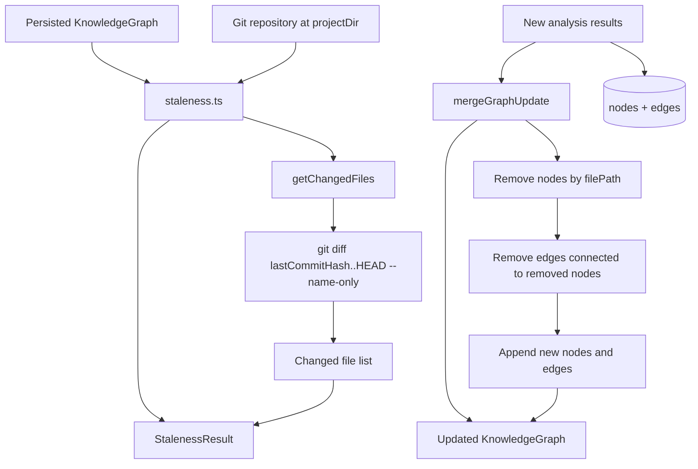
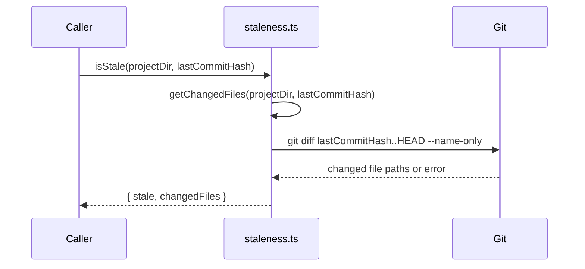
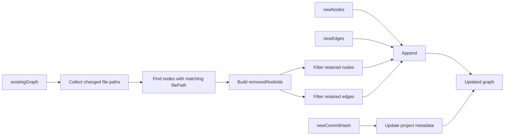
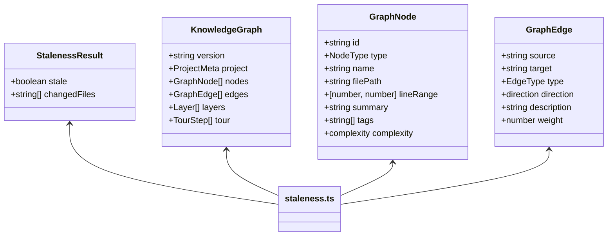
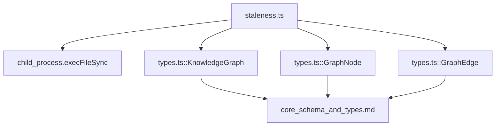
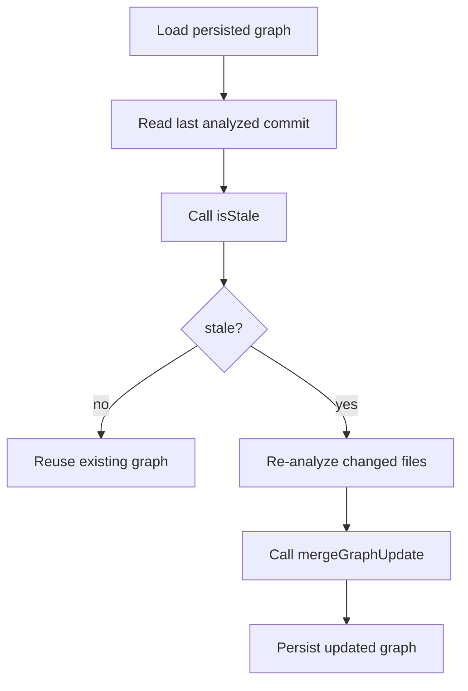

# Staleness and Graph Merging

This module provides the minimal change-detection and incremental graph-update logic used by the core analysis pipeline. It answers two questions:

1. **Is the current knowledge graph stale?**
2. **If so, how do we merge fresh analysis results into the existing graph without rebuilding everything?**

The implementation is intentionally small, but it sits at an important boundary between repository state, Git history, and the persisted `KnowledgeGraph` model.

---

## Purpose

`staleness.ts` contains three responsibilities:

- Detect changed files between a stored commit and `HEAD`
- Report whether the graph is stale
- Merge newly analyzed nodes and edges into an existing graph while removing outdated content

This module is typically used after a previous analysis run has been persisted and the system wants to determine whether the stored graph still reflects the current repository state.

Related documentation:

- [core_schema_and_types.md](core_schema_and_types.md) for the graph data model
- [core_analysis.md](core_analysis.md) for the analysis pipeline that produces nodes and edges
- [core_change_tracking.md](core_change_tracking.md) for fingerprint-based change analysis

---

## Core API

### `StalenessResult`

```ts
interface StalenessResult {
  stale: boolean;
  changedFiles: string[];
}
```

A simple result object indicating whether the graph is stale and which files changed.

### `getChangedFiles(projectDir, lastCommitHash)`

Runs:

```bash
git diff <lastCommitHash>..HEAD --name-only
```

and returns the list of changed file paths.

Behavior:

- Returns trimmed, non-empty file paths
- Returns `[]` if Git fails for any reason
- Uses `execFileSync` with `cwd = projectDir`

### `isStale(projectDir, lastCommitHash)`

Wraps `getChangedFiles()` and returns:

- `stale: true` when at least one file changed
- `stale: false` when no changes are detected
- `changedFiles`: the list of changed paths

### `mergeGraphUpdate(existingGraph, changedFilePaths, newNodes, newEdges, newCommitHash)`

Performs an incremental graph merge:

1. Identify nodes whose `filePath` matches a changed file
2. Remove those nodes from the existing graph
3. Remove edges connected to removed nodes
4. Append newly analyzed nodes and edges
5. Update project metadata with the new commit hash and timestamp

---

## Data Model Dependencies

This module depends on the shared graph schema from `types.ts`:

- `KnowledgeGraph` provides the top-level graph container
- `GraphNode` supplies node identity and optional `filePath`
- `GraphEdge` supplies edge endpoints used for pruning stale relationships

The merge logic relies on a key assumption: **nodes derived from files carry `filePath`**, and edges reference nodes by `id`.

### Relevant graph fields

- `KnowledgeGraph.project.gitCommitHash`
- `KnowledgeGraph.project.analyzedAt`
- `GraphNode.id`
- `GraphNode.filePath`
- `GraphEdge.source`
- `GraphEdge.target`

---

## Architecture Overview



---

## Staleness Detection Flow



### Notes

- The module does not inspect file contents directly.
- It treats any Git diff output as evidence that the graph may be stale.
- Git errors are swallowed and converted into an empty change list, which means the graph will be reported as not stale in failure cases.

---

## Graph Merge Flow



### Merge semantics

#### Node removal

Nodes are removed when:

- `node.filePath` is defined, and
- `node.filePath` is present in `changedFilePaths`

This means the merge is file-scoped rather than symbol-scoped.

#### Edge removal

Edges are removed when either endpoint references a removed node:

- `edge.source` is in `removedNodeIds`, or
- `edge.target` is in `removedNodeIds`

This prevents dangling relationships after file-level pruning.

#### Metadata refresh

The merged graph updates:

- `project.gitCommitHash` to `newCommitHash`
- `project.analyzedAt` to the current ISO timestamp

---

## Component Interaction



---

## Dependency Map



### External dependency

- `child_process.execFileSync` is used to invoke Git synchronously.

### Internal dependency

- `types.ts` defines the graph structures that this module reads and mutates.

---

## Design Considerations

### Why file-level staleness?

The merge strategy is optimized for incremental updates. By removing only nodes associated with changed files, the system avoids rebuilding the entire graph when only a subset of the repository changed.

### Why remove edges by endpoint?

Edges are not revalidated individually. Instead, any edge touching a removed node is discarded to preserve graph consistency.

### Why swallow Git errors?

The implementation favors resilience over strict failure propagation. If Git cannot produce a diff, the module returns an empty list rather than throwing.

This is operationally convenient, but it also means callers should be aware that Git failures can mask staleness.

---

## Limitations

- Only detects changes relative to `HEAD` using Git history
- Does not detect uncommitted working tree changes unless they are represented in the diff range being queried
- Uses file-path matching only; symbol-level changes inside unchanged files are not handled here
- Does not deduplicate nodes or edges when appending new analysis results
- Does not validate whether `newNodes` or `newEdges` conflict with retained graph content

---

## Typical Usage Pattern



Pseudo-flow:

1. Load the stored graph
2. Compare stored commit hash with `HEAD`
3. If stale, analyze changed files again
4. Merge the new results into the existing graph
5. Save the updated graph and metadata

---

## Implementation Summary

### `getChangedFiles`

- Synchronous Git invocation
- Returns file paths only
- Safe fallback to empty array on error

### `isStale`

- Thin wrapper around `getChangedFiles`
- Converts change presence into a boolean flag

### `mergeGraphUpdate`

- File-scoped pruning
- Edge cleanup based on removed node IDs
- Metadata refresh for commit and analysis time

---

## Related Modules

- [core_analysis.md](core_analysis.md) — produces graph nodes and edges that may be merged here
- [core_change_tracking.md](core_change_tracking.md) — fingerprint-based change detection and update decisions
- [core_schema_and_types.md](core_schema_and_types.md) — shared graph and metadata types
- [dashboard_graph_view.md](dashboard_graph_view.md) — consumes the resulting graph for visualization

---

## Summary

`staleness.ts` is the core incremental-update utility for the knowledge graph. It provides a lightweight Git-based staleness check and a deterministic merge strategy that removes outdated file-derived graph content before appending fresh analysis results.

Its simplicity is deliberate: the module delegates analysis to other parts of the system and focuses only on keeping the persisted graph aligned with repository changes.
