# TreeSitterPlugin

The `TreeSitterPlugin` is the core structural-analysis plugin for the `understand-anything-plugin` codebase. It uses Tree-sitter grammars to parse source files and extract language-aware structure such as functions, classes, imports, exports, and call graphs. It is designed to be config-driven, so the set of supported languages can be expanded or reduced through `LanguageConfig` entries without changing the plugin implementation.

This module is part of the core plugin system and is typically used as the fast, deterministic analysis layer before higher-level analysis modules build graphs, summaries, or LLM-assisted interpretations.

---

## Purpose and responsibilities

`TreeSitterPlugin` provides:

- **Synchronous structural analysis** after asynchronous initialization
- **Language selection by file extension**
- **Tree-sitter grammar loading from language configuration**
- **Extractor-based parsing** for structure and call graphs
- **Graceful fallback** when a grammar or extractor is unavailable
- **Import resolution** for relative and package-style imports

It implements the shared `AnalyzerPlugin` contract, which makes it compatible with the broader analyzer pipeline.

---

## Module placement in the system

This plugin sits inside the core plugin system and depends on shared types, language configuration, and language-specific extractors.

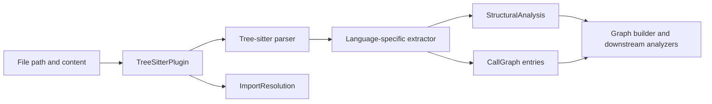

### Related modules

- [Plugin registry](plugin_registry.md) — manages plugin lifecycle and selection
- [Plugin discovery](plugin_discovery.md) — discovers available plugins
- [Shared graph and analysis types](shared_graph_and_analysis_types.md) — defines `AnalyzerPlugin`, `StructuralAnalysis`, `ImportResolution`, and `CallGraphEntry`
- [Language support](core_language_support.md) — language registry and extractor ecosystem
- [Core analysis](core_analysis.md) — downstream consumers of structural output

---

## Architecture overview

The plugin is composed of three main layers:

1. **Configuration layer**
   - Accepts `LanguageConfig[]`
   - Builds extension-to-language mappings
   - Determines which grammars should be loaded

2. **Runtime parsing layer**
   - Initializes `web-tree-sitter`
   - Loads WASM grammars
   - Creates parsers on demand for each file

3. **Extraction layer**
   - Delegates AST traversal to a `LanguageExtractor`
   - Produces structural analysis and call graph data

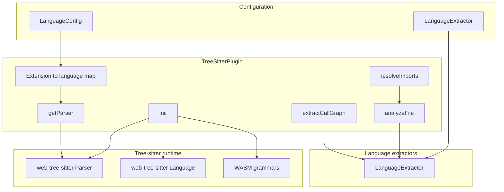

---

## Core API

### `TreeSitterPlugin`

Implements `AnalyzerPlugin`.

#### Public fields

- `name = "tree-sitter"`
- `languages: string[]` — supported language IDs

#### Constructor

```ts
constructor(configs?: LanguageConfig[], extractors?: LanguageExtractor[])
```

##### Behavior

- Filters configs to those that include `treeSitter`
- Builds extension-to-language mappings from config extensions
- Falls back to TypeScript and JavaScript when no configs are provided
- Registers either provided extractors or built-in extractors

##### Backward compatibility fallback

If no configs are passed, the plugin defaults to:

- `typescript`
- `javascript`

and maps common extensions such as `.ts`, `.tsx`, `.js`, `.jsx`, `.mjs`, and `.cjs`.

---

## Initialization lifecycle

`TreeSitterPlugin` must be initialized before use.

### `init(): Promise<void>`

Loads the Tree-sitter runtime and all configured grammars.

#### Process flow

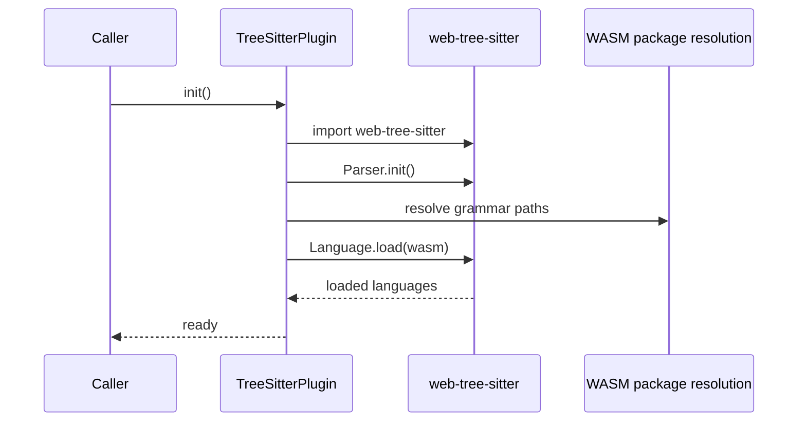

#### Important details

- Uses `createRequire(import.meta.url)` to resolve `.wasm` files from packages
- Loads grammars in parallel with `Promise.all`
- Special-cases TypeScript to also attempt loading a TSX grammar
- Skips missing grammars gracefully instead of failing the whole plugin
- Sets an internal initialized flag to prevent repeated work

#### Legacy fallback mode

When no configs are supplied, the plugin loads grammars directly for:

- TypeScript
- TSX
- JavaScript

This preserves compatibility with older setups.

---

## File-to-language resolution

The plugin determines the language key from the file extension.

### `languageKeyFromPath(filePath: string): string | null`

Rules:

- `.tsx` maps to synthetic language key `tsx`
- Other extensions are looked up in the extension map built from `LanguageConfig.extensions`
- Unknown extensions return `null`

### `getParser(filePath: string): Parser | null`

Creates a parser for the file’s language.

Behavior:

- Throws if called before `init()`
- Returns `null` when the file extension is unsupported
- Returns `null` when the grammar was not loaded successfully
- Creates a fresh parser instance per call
- Assigns the loaded language before parsing

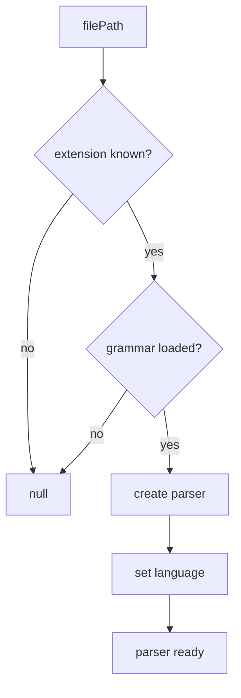

---

## Structural analysis

### `analyzeFile(filePath: string, content: string): StructuralAnalysis`

Parses a file and extracts structural information.

#### Output shape

Returns a `StructuralAnalysis` object containing:

- `functions`
- `classes`
- `imports`
- `exports`

The broader schema also allows optional non-code sections, definitions, services, endpoints, steps, and resources, but this plugin currently focuses on code structure.

#### Behavior

1. Resolve parser for the file
2. Parse source content into a syntax tree
3. Select the matching extractor
4. Extract structure from the root AST node
5. Clean up parser and tree resources

#### Failure handling

- Unsupported language → empty structural result
- Missing grammar → empty structural result
- Parse failure → empty structural result
- Missing extractor → empty structural result

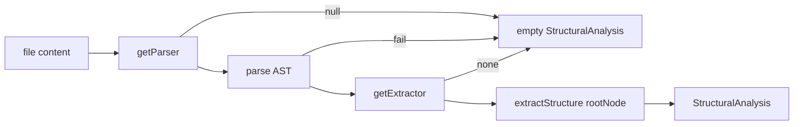

---

## Import resolution

### `resolveImports(filePath: string, content: string): ImportResolution[]`

Builds resolved import records from the structural analysis.

#### Resolution rules

- Relative imports (`./` or `../`) are resolved against the file’s directory using `path.resolve`
- Non-relative imports are returned as-is in `resolvedPath`
- Specifiers are preserved from the structural analysis

#### Notes

This method does not perform package resolution, alias resolution, or filesystem existence checks. It provides a lightweight path normalization step for downstream graph construction.

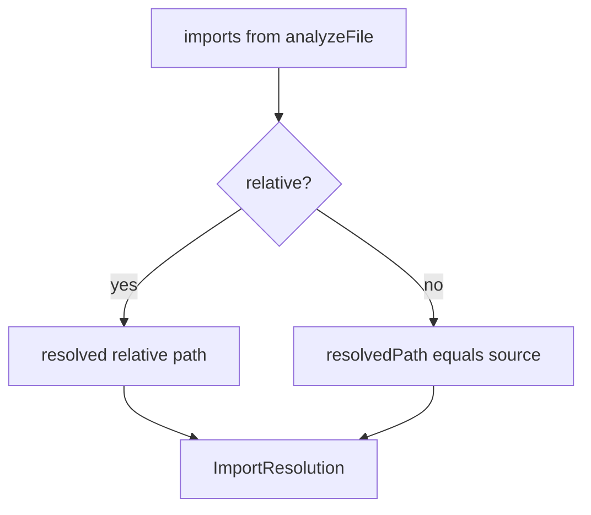

---

## Call graph extraction

### `extractCallGraph(filePath: string, content: string): CallGraphEntry[]`

Extracts caller-to-callee relationships from the AST.

#### Behavior

- Uses the same parser selection and initialization rules as `analyzeFile`
- Parses the file content
- Delegates call graph extraction to the language extractor
- Returns an empty array when parsing or extraction is unavailable

#### Output

Each `CallGraphEntry` contains:

- `caller`
- `callee`
- `lineNumber`

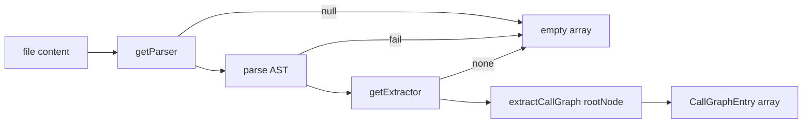

---

## Extractor system

The plugin does not hard-code language-specific AST traversal. Instead, it delegates to `LanguageExtractor` implementations.

### `LanguageExtractor`

A language extractor must provide:

- `languageIds: string[]`
- `extractStructure(rootNode)`
- `extractCallGraph(rootNode)`

### Registration

```ts
registerExtractor(extractor: LanguageExtractor): void
```

Registers the extractor for all language IDs it supports.

### Language lookup behavior

- Extractors are stored by language ID
- `tsx` is treated as a synthetic alias and mapped to `typescript` extractor logic
- This allows TSX parsing without requiring a separate extractor implementation

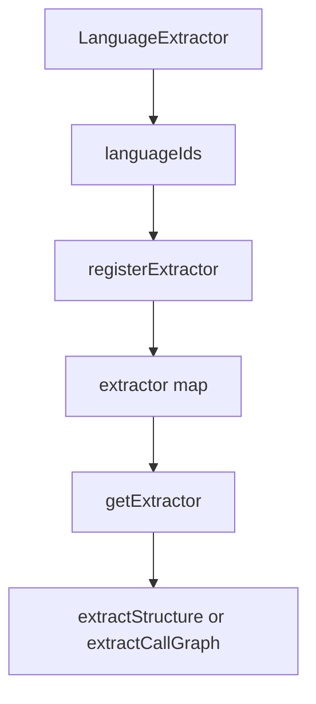

---

## Dependencies

### Direct dependencies

- `node:module` → `createRequire` for resolving WASM assets
- `node:path` → `dirname`, `resolve`, `extname`
- `web-tree-sitter` → parser and language runtime
- `../types.js` → shared analyzer contracts and result types
- `../languages/types.js` → `LanguageConfig`
- `./extractors/types.js` → `LanguageExtractor`
- `./extractors/index.js` → built-in extractor registry

### Dependency diagram

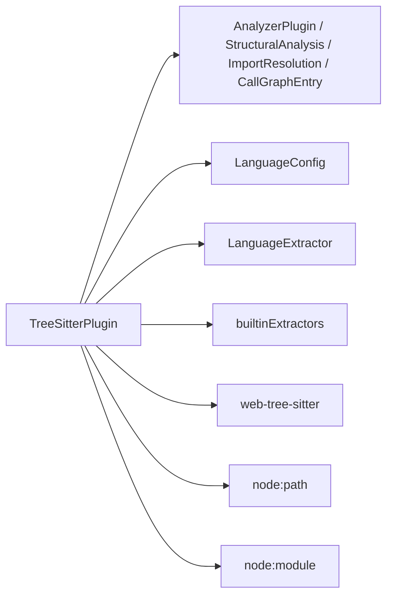

---

## Data flow summary

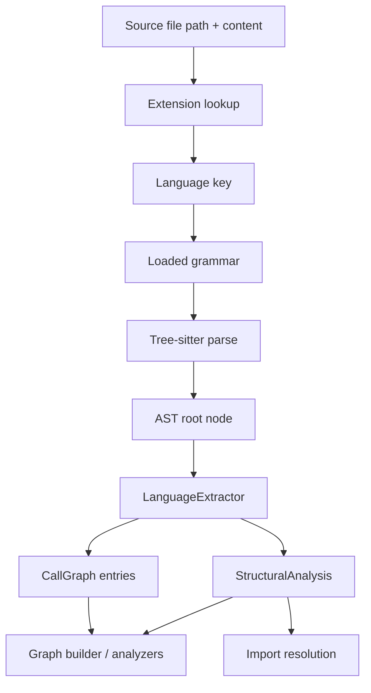

---

## Error handling and graceful degradation

The plugin is intentionally tolerant of missing capabilities.

### It returns empty results when:

- the file extension is unsupported
- the grammar failed to load
- parsing fails
- no extractor exists for the language

### It throws when:

- a synchronous analysis method is called before `init()`

This design keeps the plugin safe to use in mixed-language repositories where only some languages have Tree-sitter support.

---

## Integration with the wider system

The plugin is typically used as the first-pass structural analyzer.

- It feeds structural data into graph-building and normalization modules
- It complements LLM-based analyzers by handling languages with available grammars deterministically
- It supports downstream search, dependency mapping, and dashboard visualization by providing consistent code structure metadata

For downstream consumers, see:

- [Core analysis](core_analysis.md)
- [Graph builder](analyzer_graph_builder.md)
- [Normalize graph](analyzer_normalize_graph.md)
- [LLM analyzer](analyzer_llm_analyzer.md)

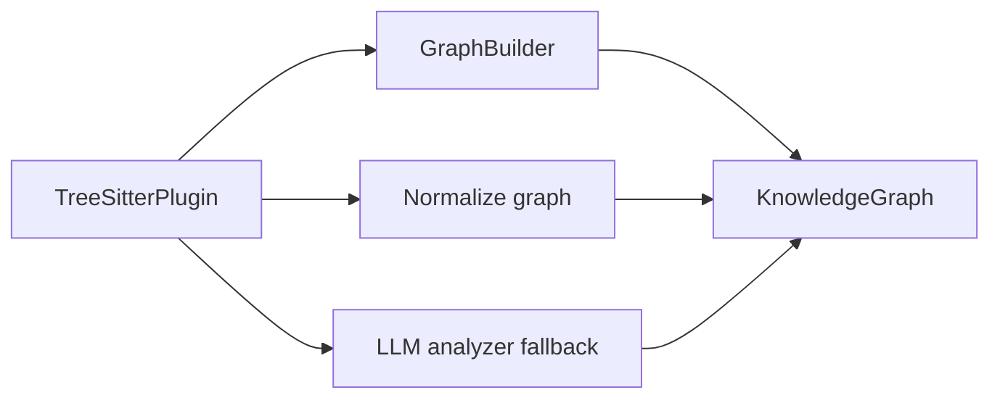

---

## Practical usage pattern

1. Construct the plugin with language configs and extractors
2. Await `init()` once at startup
3. Call `analyzeFile()` for structural metadata
4. Call `resolveImports()` when building dependency edges
5. Call `extractCallGraph()` when building call relationships

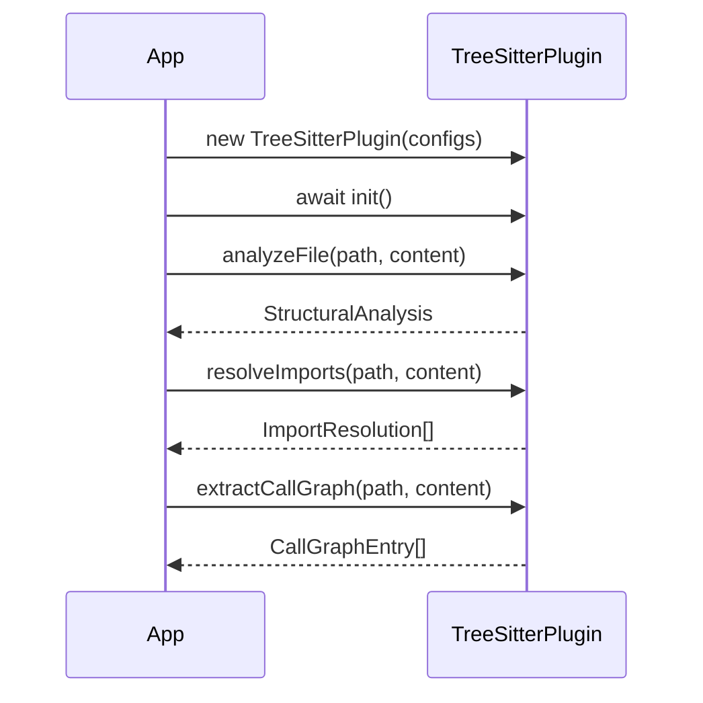

---

## Key implementation notes

- `web-tree-sitter` is loaded dynamically to avoid eager runtime coupling
- WASM grammars are resolved via package paths rather than hard-coded filesystem locations
- Parsers are created per analysis call and explicitly deleted after use
- TSX support is handled as a special case because it shares extractor logic with TypeScript
- The plugin is designed to be extensible through extractor registration rather than subclassing

---

## Summary

`TreeSitterPlugin` is the deterministic, grammar-backed structural analysis engine in the core plugin system. It converts source files into structural metadata and call graphs, resolves imports at a basic path level, and degrades safely when a language is unsupported. Its config-driven design makes it the primary bridge between language support, AST extraction, and downstream graph analysis.
